## 7.11

### 关于CSI的研究

Wang等人讨论了一种名为WiFall的设备自由坠落检测系统，该系统利用无线信号传播模型和CSI来检测坠落，而无需可穿戴设备。具体来说，它利用了CSI的时间可变性和特殊多样性。该系统由一个两阶段检测架构组成：一种基于局部异常值因子的算法，用于识别异常的CSI系列，以及使用一类支持向量机进行活动分类，以区分跌倒与其他人类活动。

Pu等人使用多普勒频移属性从无线信号中提取人类手势和运动信息。

WiSee还利用人类手势的连续性，并使用二元模式匹配算法对它们进行分类，将这些多普勒频移映射到手势。此外，该系统通过利用多输入多输出功能来专注于特定用户的手势和动作，从而在多个用户面前有效工作。

在WiTrack项目中，基于人体的射频反射进行3D人体运动跟踪。此外，WiTrack还可以对较大的人体部位（如腿或手臂）进行粗略跟踪。

在Wi-Vi项目中，Adib等人证明，在封闭房间的墙壁和门后也可以检测到人体运动。

在E-eyes项目中，研究人员引入了一种低成本系统，用于使用WiFi接入点和设备识别家庭环境中的活动。该系统使用 CSI 样本的累积移动方差来确定是否存在步行或就地活动。

#### 使用的一些深度学习方法

Chen等应用Bi-LSTM和注意力机制来学习CSI幅度和相位特性。

Guo等应用了与CNN相结合的LSTM网络

Zhang等提出了用于CSI信号安全的对抗性自编码器网络,通过用生成的对抗信号替换原始信号，修改了受保护的语义特征，并保留了需要识别的其他语义的重要特征。密集的评估表明，使用所提出的AAENs，可以显着降低受保护语义的识别准确性，同时仍保持其他语义的正确识别。

江等提出一种与环境无关的网络，由特征提取器、活动识别器和域鉴别器三部分组成，产生与环境无关的活动特征。

#### 1.基于WiFi信号的室内隐私保护的理解与建模

 现有的问题： 现有的WiFi识别方案能够发现室内语义的模式，如人类活动、身份、室内环境等。我们注意到，信道状态信息（CSI）为黑客提供了学习室内隐私的机会，但是，目前缺乏对CSI的安全研究。

挑战：第一个挑战是如何精确地修改 CSI 的私有语义信息，同时仍然保留其他必需的信息。第二个问题是如何设计适合各种分类器（如softmax、支持向量机（SVM）等）的隐私保护方法，因为目前CSI基于信号的识别系统使用了不同类型的分类器。

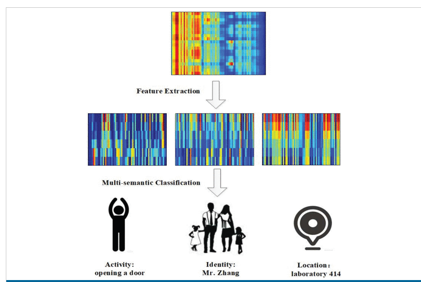

第一行：CSI 的原始样本。第二行：分别包含活动、身份和位置信息的三个不同的语义特征。第三行：该 CSI 样本的多语义识别结果。

所提出的AAEN是一个自编码器网络，其输入是原始CSI信号x ，其输出为对抗信号x‘。 CSI 安全性是通过为每个用户训练受保护的 AAEN 来消除隐私信息来实现的。从CSI信号数据库中，在信息保护步骤中，每个原始信号x 转化为对抗信号x′ 通过训练有素的 AAEN。生成的对手信号x′ 拥有与原始信号相同的大小x 并且不影响有价值的信息保存。尽管用户不知道现有的对抗信号，但他们仍然可以使用接收到的信号进行多语义分类x′ .更重要的是，原始的CSI信号不需要传输，任何人都无法从对抗信号中获悉隐私内容。因此，我们提出的方法可以很好地保护CSI信号。

### 2.一种基于机器学习自动分割的WiFi CSI信号增强框架，用于活动识别

#### CSI收集平台

### 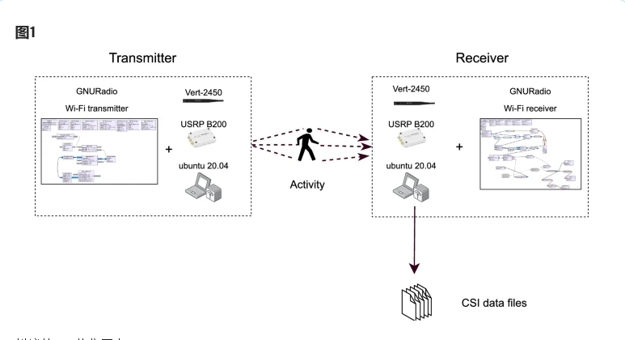

基于WiFi的CSI采集平台由WiFi发射器和接收器组成。一个人的位置在发射器和接收器之间，因此会移动并改变无线信号的传播方式。接收器负责定时同步和提取 CSI，CSI 根据人的动作而变化。

#### 信号预处理技术 

信号预处理是提高识别精度的重要阶段，因为它有助于从接收到的信号中提取有价值的信息或降低噪声。最常见的信号处理技术是低通滤波、汉佩尔滤波、小波变换和主成分分析 （PCA）。

#### 自动信号分割

信号分割是确定时域中所考虑的人类活动的开始和结束的过程，因为如果我们能够精确地捕获信号开始与结束的时刻，精度可能会显着提高。

传统的信号处理程序自动确定活动的开始和结束。该算法的一般思想是估计用于分割的灵活阈值 *ThH*，但它具有数据集依赖性的局限性。

为了克服传统信号处理算法的局限性，其使用机器学习技术进行自动活动分割。这种方法的主要优点是独立于数据集类型，这使得无线人类活动识别更加逼真。

首先，我们训练一个CNN模型，该模型可以将信号段分为两类：活动段和非活动段。然后，我们使用预训练模型作为 CSI 信号分割的切片窗口

#### 特征提取

时域是一种用于分析物理信号的时间序列。它可以用来描述时间变化的过程 和特征，信号值反映了已知时域图中信号随时间变化的情况。基于此原理，可以 提取时域中信号振幅信息的相关时域特征进行手势识别，从理论上来说是可行的。 并且，使用时域的统计特征相对于多普勒频移特征，小波变化特征而言，处理难 度简单，系统占用系统资源较少，可以获得丰富的无线信号特征，提取特征之后， 振幅信息更容易被区分。相较于传统的时频域特征而言，比如方差、均方根、信号熵和绝对中位差等，像CNN等神经网络能够自适应地挖掘与手势高度相关的数字特征，不受人为因素的影响。

#### 机器学习模型

在对人类手势进行分类时，使用了支持向量机（SVM）、随机森林（RF）和K-最近邻（K-NN)分类的比例超过92%

## 7.18

### 3.Simultaneous Authentication of Multiple Users Using a Single mmWave Radar

#### 主要内容：

使用商业毫米波雷达，通过检测呼吸模式实现多用户身份认证。

#### 实现方法：

使用射频 （RF） 波来远程检测独特的、自然发生的呼吸运动，工作原理是让发射器（Tx）向用户发送周期性的锯齿波，当用户吸气和呼气时，胸部运动会改变入射信号。然后，信号中的这种变化被反射回接收器（Rx），接收器分析变化以确定用户的呼吸模式。

1.信号捕获：为了增强信号质量，使用的波束成形技术需要使雷达对准用户。其在消除静态物体（例如墙壁）的反射后，测量用户的位置。接下来，实现一个聚类算法来估计用户的中心位置，最后依靠开发的机械传动装置调整雷达朝向。

2.信号处理：结合带通滤波器和自适应滤波器来消除捕获信号的噪声。为了消除不相关的身体运动反射，提出了一种信号比较方案，该方案涉及计算特定时间窗口的信号能量，主要思想是在信号上滑动一个时间窗口并计算每个窗口的能量 .然后将能量与信号的历史平均值进行比较，如果能量超过某个阈值，则丢弃窗口。然后，系统使用极值分析来分割呼吸信号。最后，采用WPD（小波包分解）和RFE（递归特征消除）技术来选择与呼吸最相关的特征。

3.为了确定身份验证系统的最佳分类器，评估了四种机器学习技术：随机森林 、KNN、基于线性核的支持向量机（Linear-SVM）和基于径向基函数的SVM（RBF-SVM）在分类器中，RBF-SVM的准确率最高，为95.77%，其次是kNN，准确率为94.07%。线性支持向量机的精度为93.04%

### 4.Toward Multi-User Authentication Using WiFi Signals

#### 主要内容：

分析WiFi信号的多径分量，并利用多径分量单独表征每个用户,分析行为特征以进行多用户身份验证

#### 实现方法：

1.信号分离与捕获：提出的 MUltipath 到达时间估计算法 （MUTA） 对 WiFi 信号的多径分量进行分析。原理是由于位于不同位置的用户反射的WiFi信号以不同的路径长度传播，因此我们可以估计WiFi信号中多径分量的传播延迟（即到达时间，ToA），从而分离多个用户引起的信号。针对因相同ToA而合并单个CSI的用户，提出一种基于到达角（AoA）的个体CSI分离方法，分别进一步分离和构建其单个CSI。

2.特征提取：单个CSI进行时频分析，通过短时傅里叶变换 （STFT） 导出时频频谱图来表征用户行为，并设计一个基于卷积神经网络-递归神经网络（CNN-RNN）的双任务模型，从图谱中提取细粒度特征，以实现鲁棒的用户认证。

#### 结果：

在走廊、会议室和实验室三个环境中重复实验，具体而言，三种情况下的认证准确率分别为89.7%、85.5%和83.4%，平均准确率为86.2%。我们可以看到，与单用户场景相比，多用户身份验证的准确性仅略有下降。

## 7.25

### 5.Mask does not matter: anti-spoofing face authentication using mmWave without on-site registration（MobiCom ）

#### 背景

通过人脸进行认证方案被普遍采用，然而，目前的FA系统主要是基于摄像头的，因此容易受到面部遮挡（例如，面罩）和欺骗攻击（例如，3D打印的面罩）。该论文利用毫米波（mmWave）的穿透能力、材料灵敏度和细粒度感知能力，构建了反欺骗FA系统mmFace。

#### 创新点

1.它通过沿特定轨迹移动商用现成 （COTS） 毫米波雷达来扫描人脸。从人脸反射回来的毫米波信号携带面部生物特征和结构特征，（解决由于孔径小，无法为FA提供足够的传感分辨率的问题）

2.探索了一种抗距离面部结构特征，以抑制不稳定的面部到设备距离的影响。

3.为了避免现场配准的不便，我们还提出了一种基于从照片到毫米波信号的跨模态转换形成的核心思想的新型虚拟配准方法。

#### 实现方法

  具体来说，通过沿特定轨迹移动毫米波雷达，mmFace可以模拟大孔径平面天线阵列，并测量从人脸反射的mWave信号。它从收集的信号中提取生物计量特征以进行活体检测。为了实现FA的目标，mmFace通过使用距离迁移算法（RMA）作为SAR成像算法重建人脸，从原始毫米波信号中推导出潜在的面部结构特征。

目前基于射频的认证方法通常要求用户完成耗时的现场注册，开发了一种跨模态我们构建了一个虚拟配准场景，并在此基础上构建了毫米波信号传播模型来生成虚拟注册信号（VRSes）。基于二维照片构建人脸的3D模型在计算机视觉中得到了广泛的研究，本论文根据facegen中提出的方法生成用户的精确三维模型。最后，将3D人脸模型与虚拟平面天线阵列旋转并对齐，以调整它们的相对位置（3D人脸模型的下巴应与虚拟平面天线阵列底部边缘的中心对齐）。至此，如图所示，虚拟重建了与真实认证场景一致的注册场景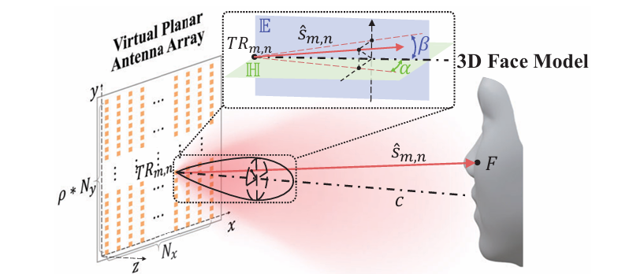

面部图像上的明/暗区域对应用户具有高/低表面曲率的面部区域，如图所示。因此，明亮区域的轮廓可用于表示面部结构特征。2）即使改变认证距离，明亮区域的轮廓也相对稳定，如图7所示。通过这些观察，我们可以有把握地声称，明亮区域的轮廓主要由面部表面曲率决定，而不是由验证距离决定。因此，它可以作为抗距离的面部结构特征。

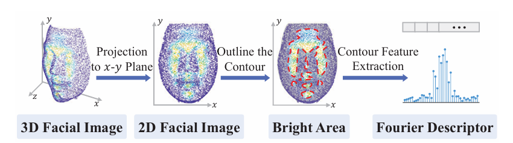

#### 结果

通过对30位参与者进行的大量识别实验，表明mmFace的平均身份验证成功率超过96％.（在固定的15cm处验证）

鲁棒性测试：

距离；即从 10 厘米到 20 厘米的地方进行身份验证，身份验证成功率均高于90%

口罩遮挡：随着掩模遮挡面积率的增加而略有降低。即使遮挡面积率为100%，平均ASR仍为90%左右，表明mmFace对掩模的遮挡具有鲁棒性

2D,3D攻击测试：

该方法能够抵御所有的2D攻击，3D攻击中除了金属面罩对于其他面罩的抵御成功率为100%，金属面罩在验证距离减少时候，抵御成功率会下降，但仍在90%以上.

### 6.XModal-ID: Using WiFi for Through-Wall Person Identification from Candidate Video Footage(MobiCom)

#### 创新点：

1.提出了一种新的方法来模拟WiFi信号，该信号将由一对收发器根据一个人行走的视频片段进行测量。更具体地说，我们提取视频中人物的 3D 网格模型，并应用 Born 近似来模拟视频中的人在 WiFi 区域行走时相应的 WiFi CSI 幅度测量值。

2.提出了一个新的框架和一组功能，可以根据WiFi CSI幅度信号来捕捉一个人的步态特征。

#### 背景：

考虑犯罪录像可用并且警察正在寻找嫌疑人的场景。疑似藏身建筑物外的一对WiFi收发器可以使用XModal-ID来检测此人是否躲藏在里面。

考虑一个智能家居，每个居民都有个人偏好（例如，照明、环境和温度）。家庭WiFi网络可以使用XModal-ID和居民的一次性视频样本来识别在房屋任何区域行走的人并激活他/她的偏好。

#### 实现方法：

XModal-ID从视频中构建了该人的3D网格，然后计算出该人在存在一对WiFi收发器的区域行走时产生的相应WiFi信号（它这样做时不知道该人的轨迹或区域）。然后，它将此模拟的 WiFi 信号与在感兴趣的人行走的区域测量的真实 WiFi 信号进行比较。根据模拟的WiFi信号与真实WiFi信号的相似性，系统判断在WiFi区域行走的人是否为视频中的同一个人。

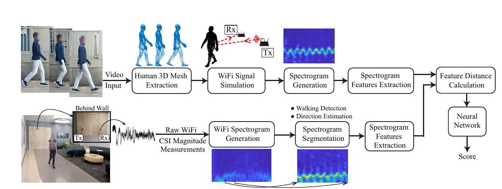

#### 结果：

在所有实验中，路径都进一步假设未知。总体而言，该测试集总共包含2,256对WiFi和视频样本。给定一对视频和WiFi样本，XModal-ID在判断两个样本是否属于同一个人时，实现了85%的二分类准确率。此外，在给定查询的WiFi数据样本和8个候选视频样本的情况下，XModal-ID在视频样本排名中分别实现了75%、90%和97%的top-1、top-2和top-3准确率。

 ### 7.RadHAR: HumanActivity Recognition from Point Clouds Generated through a Millimeter-wave Radar(MobiCom)

#### 背景：

准确的人类活动识别 （HAR） 是实现新兴环境感知应用的关键，这些应用需要理解和识别人类行为，例如，监控独居的残疾人或老年人。传统上，HAR是通过双边传感器（例如摄像头）或可穿戴设备。但是，在隐私敏感区域（例如家中）使用摄像头可能会捕获用户可能不愿意分享的多余环境信息。雷达已被提议作为粗粒度活动识别的替代模式，它使用微多普勒频谱图捕获环境信息的最小子集。然而，由于低成本毫米波 （mmWave） 雷达系统会产生稀疏且不均匀的点云，因此训练无粒度、准确的活动分类器是一项挑战。

#### 贡献：

提出了RadHAR，一个用于对毫米波雷达生成的点云进行人类活动识别的框架

评估了使用点云进行人体活动检测的不同机器学习方法。

生成了一个新的用于人类活动检测的点云数据集，并将其与数据处理、分类器训练和评估代码以及预训练分类器一起开源使用。

#### 实现方法：

本文中，提出了RadHAR，这是一种使用稀疏和非均匀点云执行准确HAR的框架。RadHAR 利用滑动时间窗口从毫米波雷达中积累点云，并生成体素化表示，作为分类器的输入。我们使用低成本、商用、现成的雷达来评估 RadHAR 以获得视觉上不太显眼的稀疏点云。

##### 数据集收集与预处理：

使用IWR1443BOOST雷达，用户在雷达前执行 5 种不同的活动：步行、跳跃、开合跳、深蹲和拳击。捕获的点云包含空间坐标（x、y、z，单位为米）以及速度（单位为米/秒）、范围（点与雷达的距离）（单位为米）、强度（dB）和方位角（度）。为了克服每帧中点数的不均匀性，将点云转换为维度为 10x32x32 （depth=10） 的体素，这使得无论帧中的点数如何，输入的大小都是恒定的。由于活动是在一段时间内执行的，因此会生成活动的时间窗口，以限制时间依赖性。我们创建 2 秒（60 帧）的窗口，滑动因子为 0.33 秒（10 帧）。所以在时间窗体素表示中，每个样本的形状为 60 ∗ 10 ∗ 32 ∗ 32。

##### 分类器训练：

训练了SVM、MLP、双向LSTM、 Time-distributed CNN+ Bi-directional LSTM网络。SVM分类器性能较差，测试准确率为63.74%、MLP分类器由全连接层组成，该层不假设任何关于输入数据的信息，测试精度为80.34%。LSTM的性能明显优于MLP，测试精度为88.42%。。性能最好的分类器是时间分布CNN+双向LSTM，其测试准确率为90.47%。

### 无线感知方面总结：

#### 主要任务：

1.定位与轨迹追踪。

2.身份识别验证，被动的认证：主要通过生理信号（心跳、呼吸、手指阻抗等）或者通过步态体型等，如果使用主动认证的话还可以通过毫米波雷达实现人脸识别，还有比较特殊的在空中的签名认证。

3.包括手势等动作姿态的识别，可以通过传统的csi，或者雷达点云实现。

### 9.18

---

### 身份认证（或识别）方案

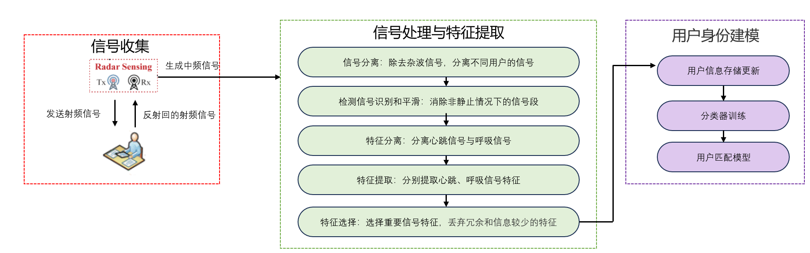

#### 研究目标：

实现一个基于毫米波雷达的身份认证（或识别）系统，能够在例如办公室的环境下实现多人的身份认证，能够实现对常见攻击模型例如任意攻击、重放攻击等的检测。。具体研究内容涵盖生理信号处理，特征提取，用户匹配模型训练。

#### 认证因素：

首先要确定需要收集的数据，本方案主要围绕于有着被动的、持续的、非侵入性的身份认证方案。根据之前多篇论文的介绍，收集的数据主要为生理信号（呼吸、心跳），步态特征、声纹与点云生成的人脸（可能持续认证这一特点不明显）等。接下来我将介绍各个特征的原理。

**心跳特征**:其基本原理是检测由心跳活动引起的皮肤表面振动的波动。具体来说，毫米波传感器向用户发射调频连续波 （FMCW），然后反射信号由心跳引起的皮肤振动调节并被传感器接收。

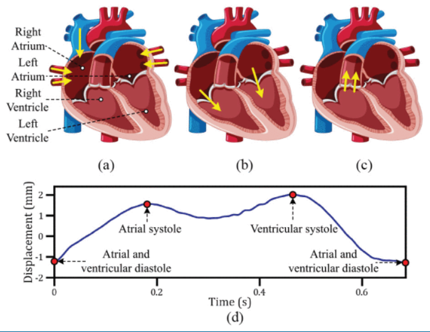

可行性分析：1） 不同的用户在周期模式方面具有不同的信号，例如波峰/波谷之间的幅度和宽度，当然可能还有更多的时频域特征和高维特征可以用于区分不同用户 2） 来自同一用户的心跳模式在连续周期中相对稳定。

**呼吸特征**：雷达设备的工作原理是让发射器 （Tx） 向用户发送调频连续波 （FMCW）。当用户吸气和呼气时，胸部运动会改变入射信号。然后，信号的这种变化被反射回接收器 （Rx），接收器 （Rx） 分析变化以确定用户的呼吸模式。

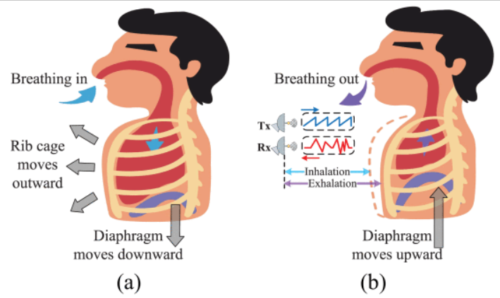

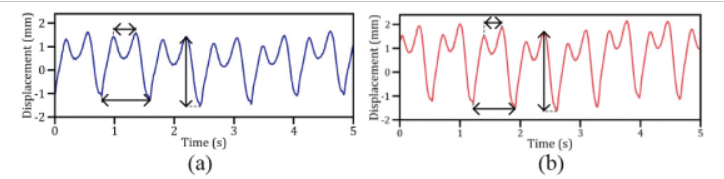

可行性分析：要求两名参与者面向设备坐下并正常呼吸。如图  所示，它们的呼吸波形明显不同。脉高、脉宽、脉率和脉动波动等形态特征在用户 a 和用户 b 之间表现出明显的差异。这些差异主要是由于肋间肌力量和肺容量的个体差异。这项研究表明，毫米波甚至可以捕捉到呼吸运动中的最小差异，这促使我们使用这些独特的特性来进行身份验证。

#### 信号捕获模块：

本文的身份认证方案考虑一个多人的典型室内场景，比如说实验室，教室等，毫米波雷达放置在一个房间的角落，里面有几个人和桌椅等。当雷达将射频信号传输到房间时，信号会从用户、桌椅和墙壁上反弹，然后返回到系统。生成的多路径反射叠加在无线信道上，并在接收端产生干扰。我们的目标是识别人类反射信号与其他静止物体反射的信号，并将来自环境中多个用户的单个信号分开。

A.信号分离：对于远处与雷达距离为d1的对象，将 TX 和 RX 线性调频混合，以生成中频 （IF） 信号。IF信号的频率差直接反映了目标的距离信息。雷达通过测量IF信号的频率能够精确计算出目标的距离。通过对IF信号的频谱分析，雷达可以同时分辨多个不同距离或速度的目标。由于静态对象的距离是固定的，因此它们的反射信号随时间变化是恒定的。因此，通过消除这种时不变的信号，我们可以只留下来自人类的反射。在这种情况下，使用傅里叶变换来处理由多个音调（频率分量）组成的信号，从而产生一个频谱，每个音调都有离散的峰值，每个峰值都表示在一定距离处存在一个物体。为了区分用户，仅使用距离信息是不够的，因为他们可能与雷达具有相同的距离（即d1=d2 ），但方向不同，因此可以引入另一个水平距离参数来确定用户相对于雷达的位置。

B.检测信号识别和平滑

实践中，人们不太可能一直保持静止，他们可能会有手或肢体运动，例如在键盘上打字、看书和喝酒。为了消除对信号提取的负面影响，我们的基本思想是比较某个时间窗口内的信号能量。具体来说在信号上滑动一个特定的时间窗口,对于每个窗口，我们然后计算信号的能量.将当前窗口的能量与信号的历史平均值进行比较。如果它的能量足够高于平均水平(根据经验为3倍左右)。

C.心跳信号与呼吸信号分离 

呼吸频带通常位于 0.2 到 0.5 Hz ，心跳运动通常在 0.67–3.33 Hz 的范围内，因此可以采用采用了巴特沃斯带通滤波器分离心跳信号与呼吸信号，当然目前大部分论文都是根据单一因素进行身份认证的，后面可以讨论结合多模态技术进行优化。

D.特征提取

使用小波包分解（WPD）对特征段进行细粒度分析.如下图所示使用了一个3 级 WPD，WPD将片段分解为细节（D）和近似（A）分量，每个层级上具有相应的高通（G）和低通（H）滤波器。在WPD中，我们在不同的频域进行多分辨率分析，以捕获具有代表性的生物特征，并识别个体之间呼吸运动的细微差异。将原始段逐级放大，共生成∑3i=12i=14个子空间。每个子空间覆盖了频谱的一部分，便于学习不同的特征。我们可以选择四个统计指标，偏度、峰度、形状因子、脉冲因数。

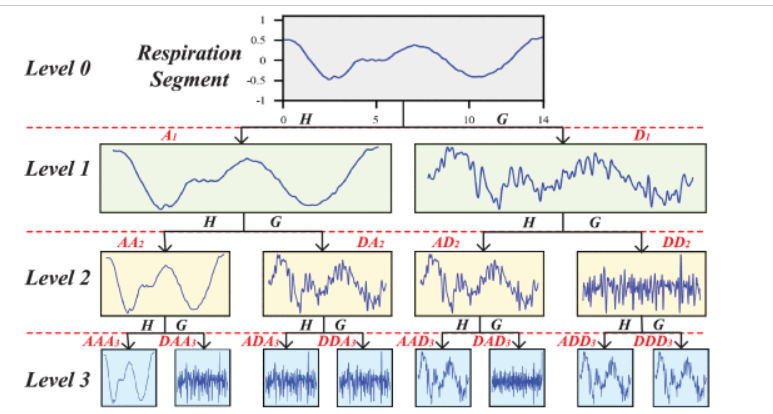

E.特征选择

使用采用线性核支持向量机（SVM）的RFE方法实现这样的过程。为了搜索特征的最佳子集，RFE 从数据集中的所有 56 个特征开始，然后删除低相关性特征，直到保留所需的数量。

（可能的创新点）多模态的方法

将提取的呼吸信号、心跳信号（或者再加入步态信号等），将多个生命体征信号用作后续模型的输入。

例如有论文中，对将心跳和呼吸信号进行归一化。归一化的目的是确保呼吸、心跳和具有一致的尺度，并消除数据之间的幅度差异。标准化数据还可以加速算法训练过程的收敛并提高模型的准确性。并使用 Z 分数标准化方法进行归一化，然后使用滑动窗口对两个个归一化模态信号进行分割，以产生具有一致窗口长度的模态信号。

### 用户匹配模型：

A.机器学习浅层分类器

若要将软件移植到嵌入式处理器，倾向于使用基于机器学习的浅层分类器来训练用户匹配模型,可以使用随机森林 (RF)、k 最近邻 （KNN）、多层感知器 （MLP） 和基于径向基函数的 SVM （RBF-SVM）等分类器，使用五重交叉验证和网格搜索方法来调整它们的参数以获得最佳性能。由于我们的任务是一个多分类任务，可以执行 one-vs-rest 策略来训练分类器。

B.神经网络

可以使用ResNet 等网络提取特征，进行分类。例如在多模态融合算法中，使用ResNet 的网络提取不同模态信号的空间特征，然后通过空间通道注意力融合模块将这些空间特征融合。接下来，使用时间序列自注意力机制从融合结果中提取时间特征。最后，在用户识别部分，对提取的特征向量执行分类任务，用于用户识别目的。

### 攻击模型：

1）*任意攻击：*攻击者与授权用户保持在同一位置，妄图实现随机检测信号事件来产生相同的影响并通过认证。

2）*信号重放攻击：*使用另一个毫米波雷达放在隐蔽的地方，获取合法用户的反射信号，然后将录制的信号注入系统

### 性能评估：

1）*认证精度：*它表示经过正确验证的正品样本的百分比。

2）*攻击成功率：*它表示系统错误接受的攻击实例的百分比。较低的攻击成功率意味着系统可以更有效地检测欺骗攻击。

### 9.26

激光雷达这块，没有看到一篇论文使用。

相关论文现状：目前在单用户、2m左右距离，识别的准确率都在96%左右。4m内的3、4个用户准确率还能到90%左右，更多用户准确率下降很多。

特征已经找的差不多了，除了生理的心跳、呼吸。动态的步态，或者通过点云或者其他成像技术获取的姿态和体型特征。大部分论文都在卷模型，卷准确率。

用的比较多的就ti系列的iwr1443、iwr1642、iwr1843这些。2500-3000左右

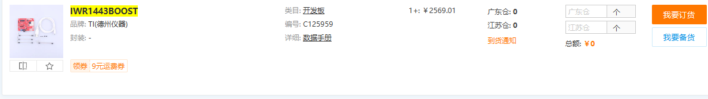

之前看到很多论文都用了iwr系列+DCA1000配套。

后面去ti官网找了下资料，uart的传输速率最高只有3.125M/S，根据下面公式说是会限制数据刷新率，但是我也不知道这个有什么影响。

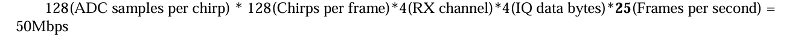

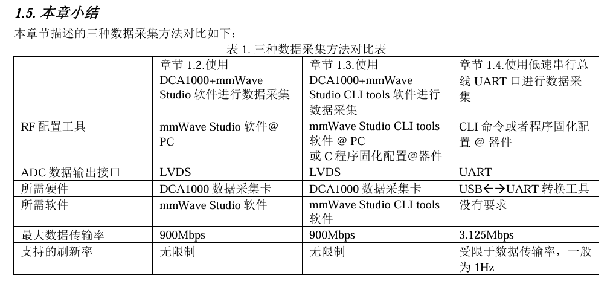

后面问了西电一个没有使用DCA1000来做这个的老师。

这个数据采集卡主要是让你把雷达采集的模拟信号变成格式、采样率等一致的数字信号，然后最主要是让你可以通过网络发送这些数据到目的IP上。如果你有这类场景需求，即数据需要网络发送的就要使用这个卡，如果没有可以不需要，这样你对雷达数据有更高的自定义。

### 10.17

---

# 基于毫米波雷达的身份认证方案

## （一） 主要研究目标

整体目标是建设一个基于毫米波雷达的身份认证系统，能够在一定距离内通过用户的生理信号实现对多个用户的身份认证，同时该系统需要对常见的信号攻击进行有效的抵御。具体研究内容涵盖信号预处理技术、用户身份建模技术、以及身份认证软件。

## （二） 研究内容

1.信号预处理技术 当雷达探测到距离为的 d1 物体时，会将 TX 和对应的RX啁组合在一起，产生中频（IF）信号。而信号预处理技术要做的就是从这些中频信号当中提取出能表征用户身份的生理信号。具体工作有三步。首先，消去背景与用户无关的静态信号。其次，可以根据距离和角度区分不同用户的信号。最后，从用户信号中提取相应的生理信号，并选取合适的特征。

2.用户身份建模技术。选取合适的网络提取特征并进行多模态融合，存储用户生物识别模板。

3.在身份验证期间，匹配模型将新的传入检测信号与存储的用户生物识别模板进行比较，以确定用户是否已通过身份验证或是否已检测到攻击，并可将上述工作打包成一个上位机软件，形成一个实时检测系统。

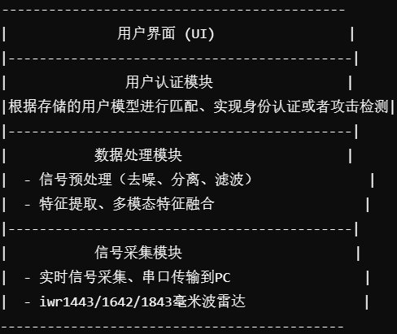

目前存在的问题以及想法：

1. 心跳受身体运动的影响。准静态：手部和肢体运动，这些运动会压倒心跳产生的轻微皮肤振动，甚至人走动起来。这时常规的做法会要求测试者保持不动，或者通过检测将这一段信号删除。这时相当于系统就会处于空闲状态。这是我们可以引入对于姿态的分析，人体的姿态中也蕴含了一部分身份特征信息。完全动态：可以结合步态信息。
2. 考虑一种信号攻击，比如攻击者通过另外一只雷达获取合法身份用户的反射信号，通过重放信号攻击我们的身份验证系统，有论文中提出由于攻击者并不知道身份采集使用的 FMCW 啁啾配置，所以该系统能够天然对抗该攻击。那么是否可以假设攻击者成功获取了我们的啁啾信号配置呢，假设攻击者需要通过重放攻击通过验证进入某区域获取信息，那他也将暴露于雷达检测系统中，考虑毫米波雷达对于铁质墙的穿透性差，会不会有攻击者可以躲在铁牌后面通过雷达重放攻击进入某些区域，因此，可以考虑在系统中通过毫米波雷达实现人体成像，对于通过身份验证的用户加入活体验证。甚至我们可以考虑将人体体型作为一个身份特征加入用户建模系统。
3. 考虑到 AoA和检测距离会大大影响识别精准度，可以考虑加入一个移动加旋转装置。甚至在识别准静态（不走动）用户时，自动移动到最佳识别点。
4. 引入心率、呼吸异常检测模块？考虑到有些刚运动完等心率呼吸异常情况，可以在此期间暂停验证，等平稳后再进行认证。
5. 加入信号重构技术，一般来说如果要靠一段呼吸和心跳进行验证需要10s左右的时间，能否通过一段较短的呼吸、心跳信号并对其进行重构，减少完成一次认证所需要的时间，

## （三） 硬件选材

​                               

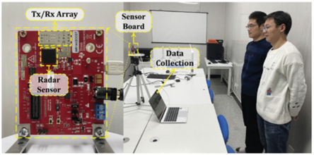

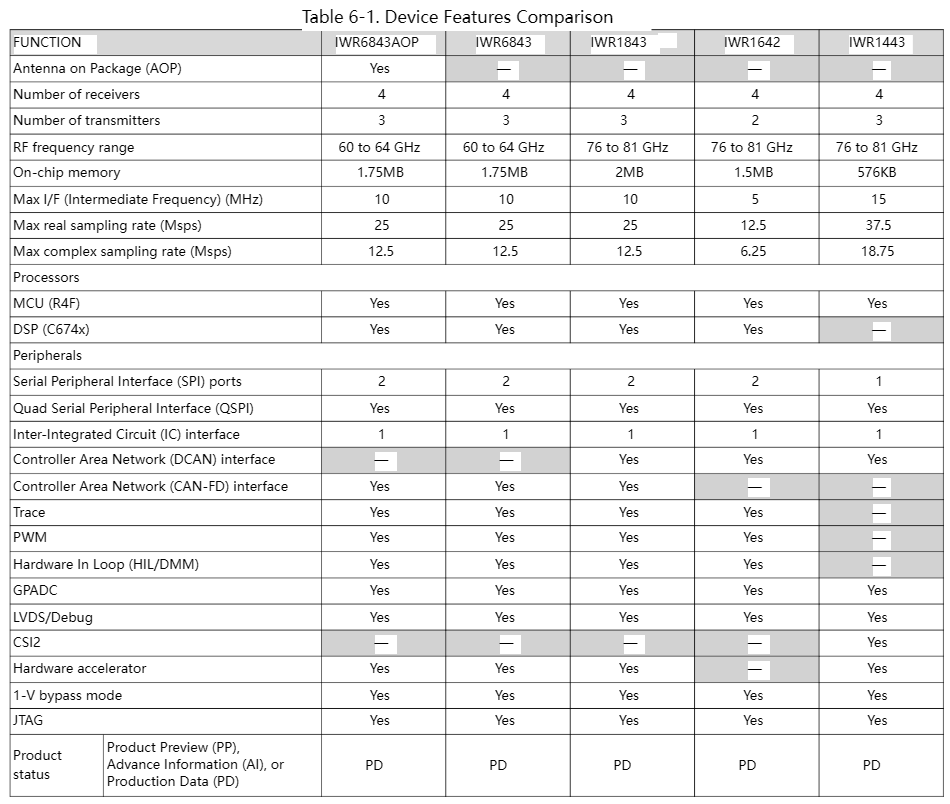

HeartPrint（心跳身份认证）中使用了iwr1443 boost

Simultaneous Authentication of Multiple Users Using a Single mmWave Radar（呼吸身份认证）中使用了iwr1443 boost

RadHAR: Human Activity Recognition from PointClouds Generated through a Millimeter-wave Radar(雷达点云活动识别)中使用了Iwr1443 boost

mID: Tracking and Identifying People with Millimeter Wave Radar（雷达点云轨迹跟踪、用户识别）中使用了iwr1443 boost

还有其他一大部分论文都使用了Ti的iwr系列雷达：iwr1443、iwr1642，iwr1843等。这些设备的区别，基本在于TX数量、内存、ADC采样率、和DSP等，

总的来说iwr1443有***最好的距离分辨率***、***没有DSP***、***内存小***的特点。鉴于这么多论文都选择了iwr1443，我觉得可能这个设备比较适合。 

至于DCA1000，与直接采集的区别

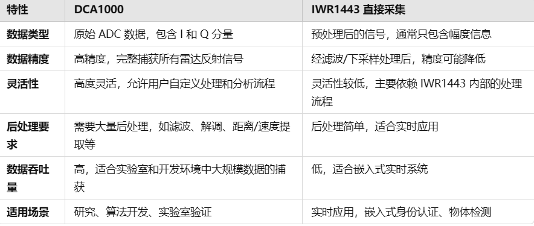

总的来说，

DCA1000适合做模型算法验证：能采集高精度原始数据，但是不能实时处理，需要采集完一段后送入matlab能软件处理。

直接采集适合实时处理：HeartPrint论文中按他的图片和描述来看应该是没有用DCA1000，他使用实时采集的数据进行算法验证最后得出的模型效果也还可以。

根据iwr1443得出的参数

**距离分辨率**

该雷达发射4GHz的连续线性调频脉冲,即带宽B=4GHz。

根据分离不同物体的距离分辨率 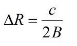

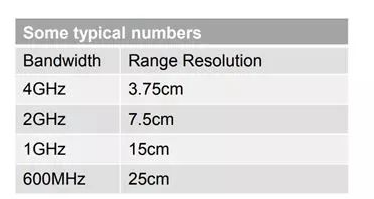

则该雷达距离分辨率为3.75cm. 如果不同物体之间的距离至少为 3.75 cm，则可以区分它们反射的啁啾声，这个距离分辨率应该已经足够，因为即使是紧紧挨着的两个人，由于手臂的阻隔，也是会大于3.75cm的。

**最大探测距离**

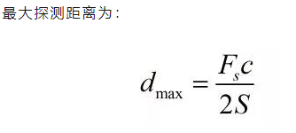

最大ADC实际信号采样率：37.5 MSPS（只包含幅度随时间变化的信息）

最大ADC复数信号采样率：18.75 MSPS(复值信号包含实部和虚部，或等效地可以表示为幅度和相位)

限制雷达探测距离的因素主要ADC采样率，以及调频斜率S，往往几个因素是相互矛盾的，需要折中选择。

例如在**HeartPrint该论文中使用的参数**

Fs=2.5M/s

c=3*10^8m/s

S=53MHZ/us

得出dmax=7m，雷达的探测距离约为7m左右。

但是一般采集的是复数信号，所以可以实际探测距离只有3.5m左右，这可能是为什么在该论文中在4m左右准确率下降到了85%，后续需要适当选择参数。·

**AOA与角度分辨率**

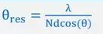

iwr1443的最大AoA为60度，雷达的角度分辨率为  ，N为RX个数，iwr1443 RX为4个，d为天线间距。在0度是分辨率最好，为2/N，对于iwr1443来说就是0.5。再考虑信号较弱和相位测量噪声较大的问题，基于他人论文的研究我们在实际应用中应该将 AoA 限制在 30° 以下，如果考虑测试者角度随机，可以使用旋转装置进行AOA的实时调整，或者使用多个雷达覆盖（成本较高）。

### 10.24

---

激光雷达通常使用的激光波长在**可见光或近红外波段**（如850nm、905nm、1550nm），波长较短，这些波长的光线在大多数固体物质（如墙壁、金属、衣物等）表面会被反射或吸收，而不是穿透。它主要依赖于反射光来测量距离，因此当光遇到不透明的表面时，信号会被吸收或反射，无法获得内部信息。

使用HeartPrint数据集进行了模型验证，选择了3周期心跳数据集（这是该论文中选取的比较适合的时间长度，增加心跳周期能提高准确率但是会使得认证时间变长）。

原模型：                    使用基于径向基函数的 SVM （RBF-SVM） 准确率：95.6%

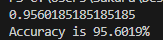

我试验的其他模型：多层感知机（MLP)                                          准确率：95.8%

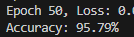

该模型的混淆矩阵：

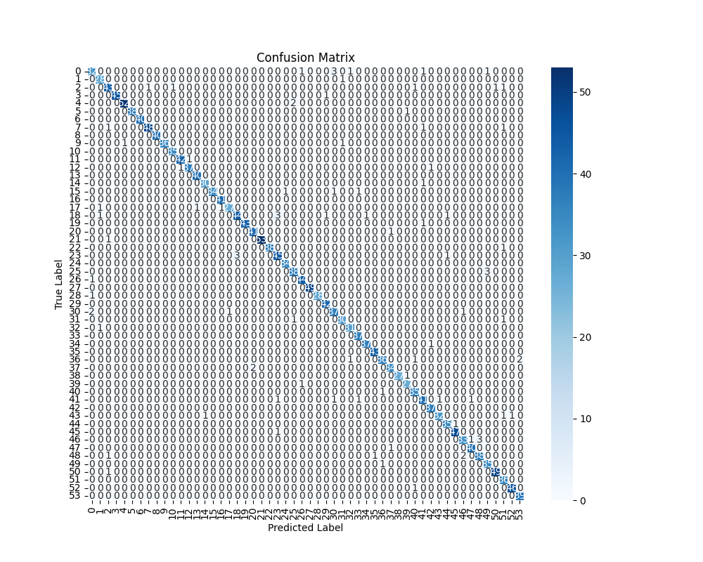

​                                   CNN                                                                  准确率：88.15%

​                                                                                                                        

​                                   LSTM                                                                 准确率：95.23%

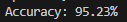

​                                   CNN+LSTM                                                       准确率：85.23%

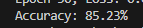

​                                   CNN+BiLSTM                                                   准确率：92.64%

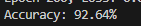

使用神经网络效果差的原因应该是数据预处理的问题，用来训练的是已经把时序信号转换成偏度、峰度、形状因子、脉冲因子这几个特征，CNN适合处理图像等数据，能够提取空间特征。bilstm、lstm等处理时序数据的能力没有体现出来，如果是将心跳的时域和频域波形直接输入可能神经网络会有更好的效果。

我去ti官网的工具箱找了一下，找到了一个用matlab写的实时采集数据的上位机，可以作为后续开发的参考，可以在此基础上修改里面，具体实现的代码还没有看完。

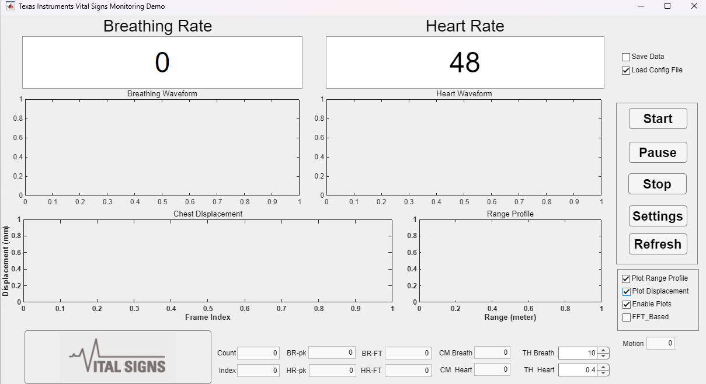

### 10.31

---

### 邱老师的成果：Millimeter-Wave Radar-Based Unsteady Vital Signs Monitoring for Smart Home（ICC)/**面向非稳态场景的生命体征监测优化方法**(计算机研究与发展 )

他们的设备：IWR6843ISK毫米波雷达模块（1500元左右）、DCA1000EVM数据采集模块。这个雷达相比之前选择的iwr1443最大的区别就是工作频率和ADC采样率降低了，这主要影响两个方面。76ghz毫米波雷达的波长为4mm,而60GHz毫米波雷达的波长为5mm,短波长信号对位移变化更敏感，当胸部同样位移1mm，77ghz探测的相位变化为pai,60ghz则为0.8pai。还有就是由于采样率的降低33%，相同配置下，最大探测距离会下降33%。根据他论文中的参数设置，最大探测的距离约为 5.6 m，距离分辨率为 3.75 cm；可以探测到的目标最大速度约为 10 m/s，基本能够覆盖人们日常居家锻炼的各种场景或者说后续进行身份认证的场景。

  如下图所示是使用DCA1000+xwr6843采集的虚数数据的ADC原始数据格式，**I分量**：这是与参考信号同相的分量，**Q分量**：这是与参考信号正交的分量。有了这两个分量可以组成虚数信号s=I+jQ.我们可以看到这是以non-interleaved(非交错)格式存储的,我的理解是，对于每一个chirp，会按照先存储RX0对于该chirp的所有采样点数，再存储RX1的所有采样点数，直到 RX channel都存储完毕，再去存储下一个chirp*为了便于后续处理，我们可以把他处理为一个[numSample\*RX,chripnum]维度的表格。

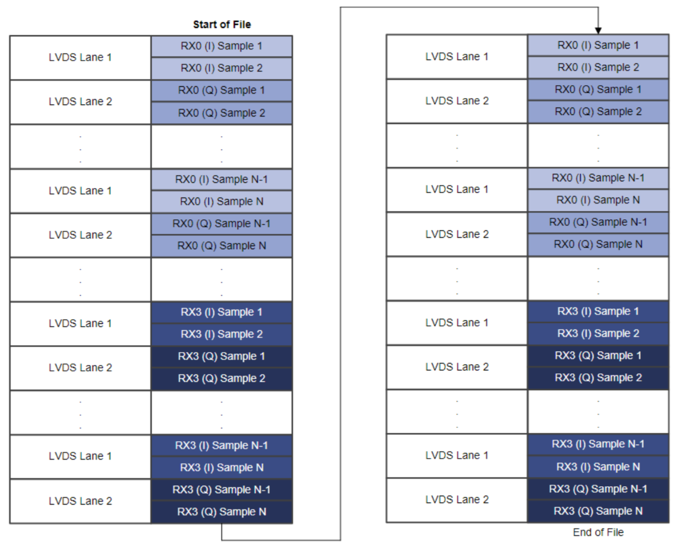

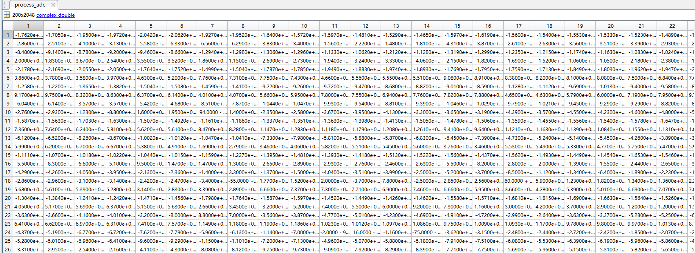
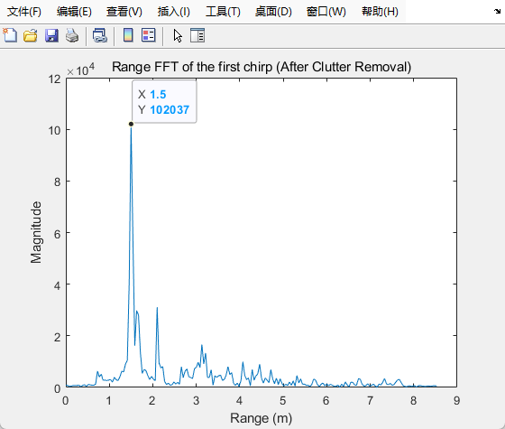

#### 主要内容：

在非稳态场景下（主要是一个运动场景下)，基于商用雷达设备，实现了对运动者进行运动状态识别以及体征监测的体征雷达系统。

#### 运动识别主要内容：

数据处理：对于1帧内的数据，将所有的chirp数据纵向排列形成矩阵，即矩阵的每一列代表1个chirp数据，对每个chirp进行快速傅里叶变换得到距离谱图.之后在每个距离上，对该帧内所有数据进行2次快速傅里叶变换，得到速度的谱图。将每一时刻中每个距离上信号强度最大的速度作为主导速度每个距离上信号强度最大速度作为主导速度，并且将连续的多个帧的距离-主导速度信息依次排列起来，得到目标的特征频谱图。之后使用滑动窗口采样法采集样本，并使用resnet分类.

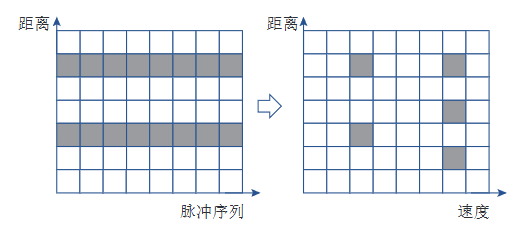

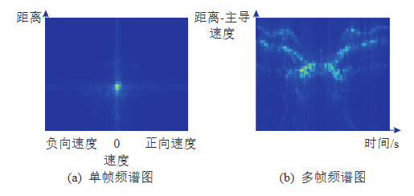

#### 体征监测主要内容：

在滤波得到生命体征信号基础上，实现了基于变分模态分解的体征信号优化算法，进一步提高呼吸信号和心率信号的精度。

#### 总结：邱老师的成果已经能提取出高精度的呼吸和心跳波形，可以提供一定的基础。

